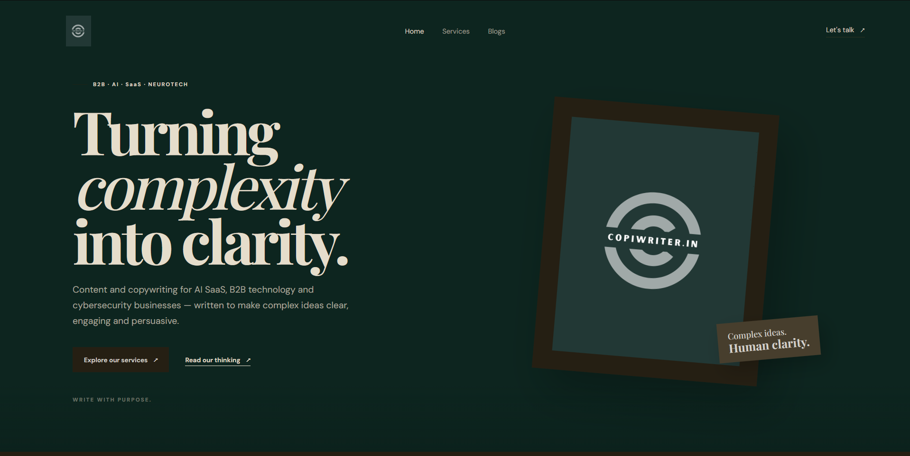

# CopiWriter.in

A production-ready B2B content and copywriting website focused on
AI SaaS, technology, cybersecurity, and emerging deep-tech businesses.

## 🌐 Live Website

https://copi-writer.vercel.app

<<<<<<< HEAD
## Add blogs
Edit the `blogs` array near the top of `src/main.jsx`.
=======
## 🎯 Project Overview

CopiWriter is a B2B content platform designed for technology-focused
businesses that need clear, technical, and conversion-oriented content.

The website focuses on presenting services, positioning the brand,
and providing a professional digital presence for technology clients.

## 🛠️ Tech Stack

- React
- Vite
- JavaScript
- HTML5
- CSS3
- Vercel

## ✨ Features

- Responsive website
- SEO-optimized pages
- B2B service presentation
- Technology-focused content positioning
- Responsive navigation
- Production deployment
- Sitemap and robots configuration

## 🚀 Deployment

The website is deployed and publicly accessible.

## 👨‍💻 My Role

- Designed and developed the website
- Implemented the frontend
- Optimized website structure and SEO
- Configured production deployment
- Improved responsive layouts and positioning

  
>>>>>>> 7c5a5e0689d8c6025db8c55c8d99cba8cb58c860
## 📸 Screenshots

### Homepage

<<<<<<< HEAD

=======

>>>>>>> 7c5a5e0689d8c6025db8c55c8d99cba8cb58c860
